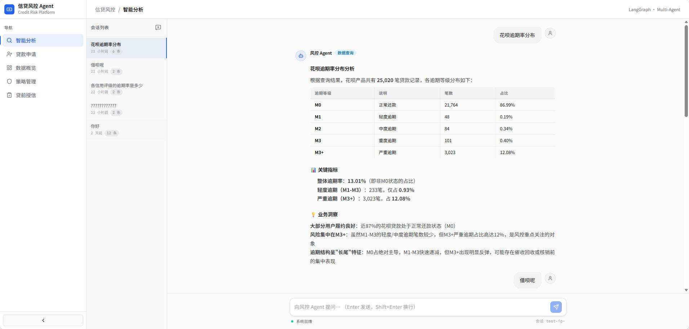
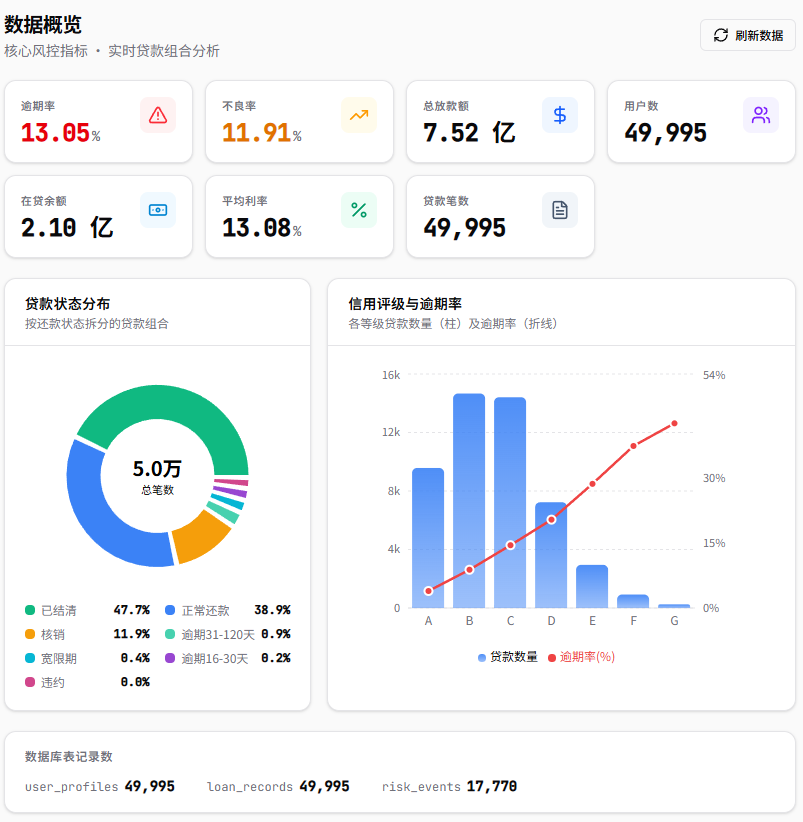
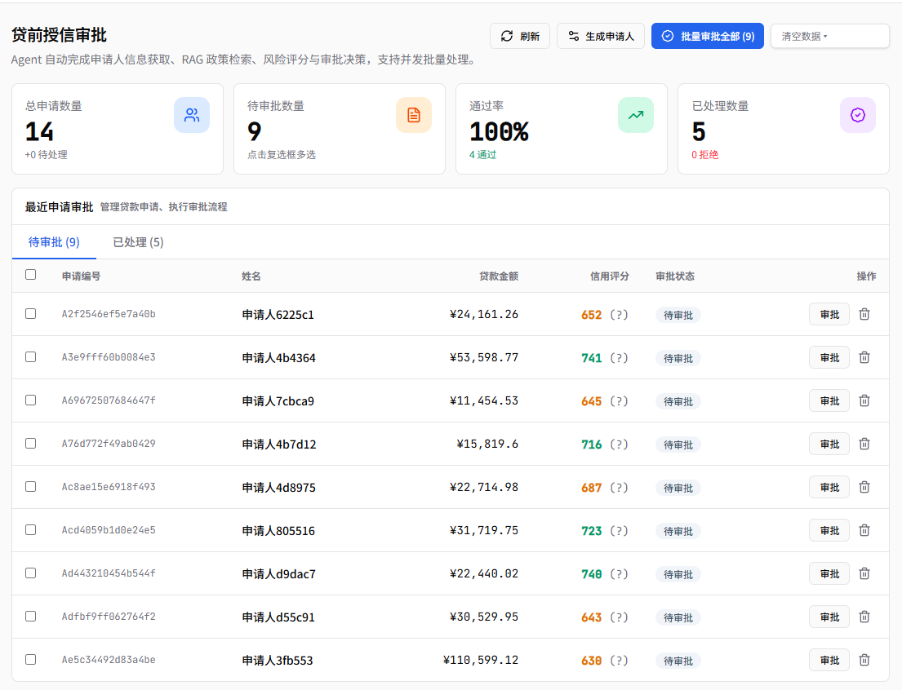
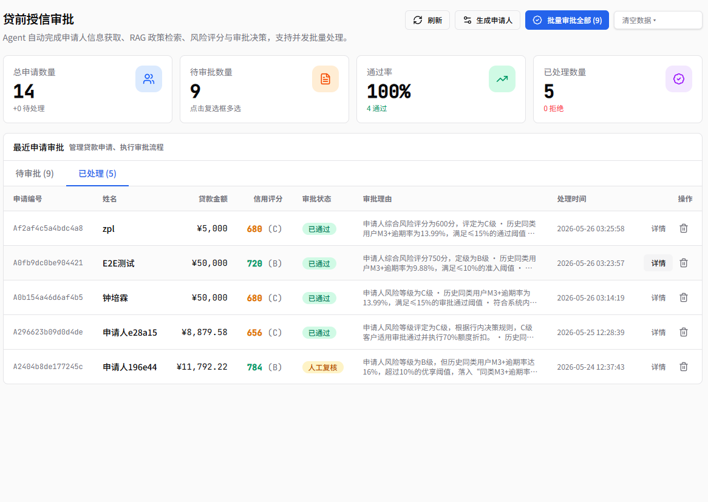
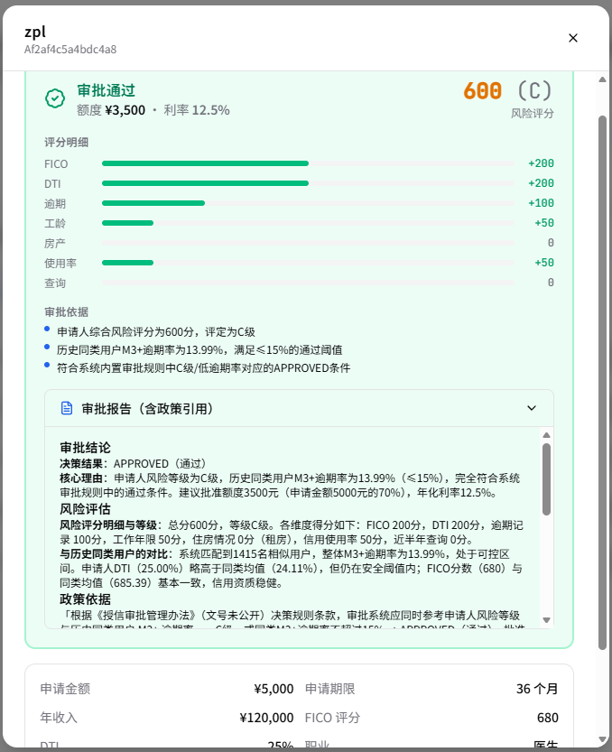
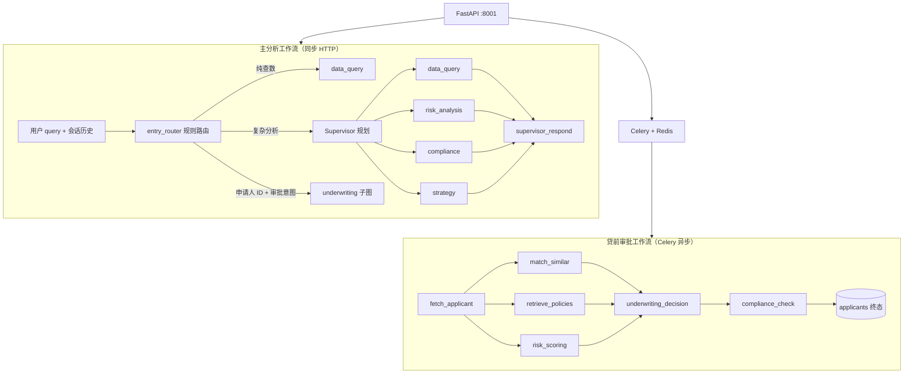

<h1 align="center">Credit Risk Agent Platform</h1>
<h3 align="center">信贷风控 Multi-Agent 平台 — LangGraph 编排 · 自然语言分析 · 异步贷前审批</h3>

<p align="center">
  <a href="https://github.com/123zpl/Credit-Risk-Agent"></a>
  <a href="https://github.com/langchain-ai/langgraph"></a>
  <a href="https://fastapi.tiangolo.com"></a>
  <a href="https://react.dev"></a>
  <a href="https://help.aliyun.com/zh/model-studio/"></a>
</p>

<p align="center">
  <b>Supervisor 主 Agent 规划</b> · <b>4 大专家 Worker</b> · <b>Celery 贷前工作流</b> · <b>SQL 只读护栏</b> · <b>Milvus 政策 RAG</b>
</p>

<p align="center">
  
</p>
<p align="center"><sub>系统流程框架 — 双轨 LangGraph（主分析同步 / 贷前审批异步）· 前端五入口 · 数据与安全底座</sub></p>

<p align="center">
  <a href="#-核心特性">核心特性</a> ·
  <a href="#-界面预览">界面预览</a> ·
  <a href="#️-系统架构">系统架构</a> ·
  <a href="#-技术栈">技术栈</a> ·
  <a href="#-快速开始">快速开始</a> ·
  <a href="#-api-一览">API</a>
</p>

---

## 🎯 项目简介

> **把「问数据、做归因、写策略、查合规、批贷款」放进同一条 Agent 流水线。**

本平台基于 **LangGraph** 构建信贷风控 Multi-Agent 系统：

- **分析链路**：用户自然语言 → Supervisor 规划 → 数据 / 风险 / 合规 / 策略 Worker → 统一汇总回复  
- **审批链路**：`/apply` 提交或运营端触发 → **Celery** 异步执行独立贷前 DAG（与 Supervisor `plan` 解耦）  
- **安全底座**：SQL 表白名单 + 只读校验 + AST 守卫；审批规则引擎 + 合规硬检查  

---

## ✨ 核心特性

- **🧠 Supervisor Plan-then-Execute**：主 Agent 负责规划与对客回复；Worker 无状态执行，输出结构化中间结果  

- **⚡ 入口双重路由（零 LLM）**：纯查数直进 `data_query`；含申请人 ID 的审批意图进贷前子图；其余走 Supervisor  

- **💼 贷前授信全链路**：待审批 / 已处理列表、批量审批、审批报告（规则评分 + LLM 报告 + RAG 政策依据）  

- **🔒 工具级安全**：`generate_sql` 经白名单与 `sql_ast_guard` 校验后才可 `execute_sql`；禁止写库类操作  

- **📚 双库 RAG**：Milvus 法规库 + 授信政策库，并行检索后汇入审批决策  

- **🖥️ 现代前端**：React + Vite + Tailwind；分析、看板、策略、贷前授信、贷款申请五类页面  

---

## 📸 界面预览

### 智能分析 ` / `

<p align="center">
  
</p>
<p align="center"><sub>纯查数意图经 entry_router 直进 data_query — SQL 只读护栏生成表格与业务洞察</sub></p>

### 数据看板 ` /dashboard `

<p align="center">
  
</p>

### 贷前授信 ` /underwriting `

<p align="center">
  
</p>
<p align="center"><sub>待审批队列 — 支持单笔 / 批量触发 Celery 审批</sub></p>

| 已处理 | 审批报告 |
|:---:|:---:|
|  |  |

> C 端入口 **`/apply`**：提交贷款申请后自动入队；前端轮询任务状态，完成后进入「已处理」。

| 路径 | 说明 |
|------|------|
| `/` | 多轮风控分析对话 |
| `/dashboard` | 数据概览 |
| `/strategies` | 策略列表与导出 |
| `/underwriting` | 贷前授信（待审批 / 已处理） |
| `/apply` | 贷款申请 → 自动贷前审批 |

---

## 🏗️ 系统架构

系统包含 **两条 LangGraph 工作流**，共用 MySQL / Redis；审批链路额外依赖 Milvus。



| 维度 | 主分析 | 贷前审批 |
|------|--------|----------|
| 触发 | `POST /api/v1/analyze` | `POST /applicants/submit` / `approve` |
| 编排 | Supervisor 动态 `execution_plan` | 固定 DAG + fan-out / fan-in |
| 响应 | 同步返回报告 | 异步；前端 HTTP 轮询状态 |
| 记忆 | 本地 JSONL 多轮压缩 | 无会话依赖 |

---

## 🛠️ 技术栈

| 层级 | 技术 |
|------|------|
| Agent 编排 | LangGraph + LangChain |
| LLM / Embedding | 通义千问 **Qwen**（[DashScope](https://help.aliyun.com/zh/model-studio/) OpenAI 兼容接口，`OPENAI_*` 环境变量） |
| 后端 | FastAPI + Uvicorn（**8001**） |
| 任务队列 | Celery + Redis |
| 数据库 | MySQL 8.0 |
| 向量检索 | Milvus（法规 + 授信政策） |
| 前端 | React 19 + Vite + Tailwind（**3000** → 代理 `/api`） |
| 基础设施 | Docker Compose（MySQL + Redis） |

---

## 🚀 快速开始

### 环境要求

Python 3.11+ · Node.js 18+ · Docker（MySQL / Redis）· Milvus（RAG，可选但推荐）

### 三步启动

```bash
# 1️⃣ 克隆与依赖
git clone https://github.com/123zpl/Credit-Risk-Agent.git
cd Credit-Risk-Agent
python -m venv .venv && source .venv/bin/activate   # Windows: .venv\Scripts\activate
pip install -r requirements.txt
cd frontend && npm install && cd ..

# 2️⃣ 配置 .env（勿提交 Git）并启动基础设施
# 在项目根目录创建 .env（参照下方变量）
docker compose up -d
python scripts/init_rag.py   # 需 Milvus + Embedding Key

# 3️⃣ 启动服务（三个终端）
python app.py
celery -A src.infra.celery_app:celery_app worker -l info -P threads -c 4 -n worker@%h
cd frontend && npm run dev
```

**Windows 一键脚本：**

```powershell
powershell -ExecutionPolicy Bypass -File scripts/dev_start.ps1
powershell -ExecutionPolicy Bypass -File scripts/dev_start_frontend.ps1
```

### 访问地址

| 服务 | URL |
|------|-----|
| 🖥️ 前端 | http://localhost:3000 |
| 📖 API 文档 | http://localhost:8001/docs |
| ❤️ 健康检查 | http://localhost:8001/api/v1/health |

<details>
<summary><b>📋 .env 常用变量（点击展开）</b></summary>

```env
OPENAI_API_KEY=your_dashscope_api_key
OPENAI_BASE_URL=https://dashscope.aliyuncs.com/compatible-mode/v1
OPENAI_MODEL=qwen-plus

EMBEDDING_API_KEY=your_dashscope_api_key
EMBEDDING_BASE_URL=https://dashscope.aliyuncs.com/compatible-mode/v1
EMBEDDING_MODEL=text-embedding-v3

MYSQL_HOST=localhost
MYSQL_USER=credit_user
MYSQL_PASSWORD=change_me
MYSQL_DATABASE=credit_risk_db

REDIS_HOST=localhost
REDIS_PORT=6379

MILVUS_HOST=localhost
MILVUS_PORT=19530
```

</details>

<details>
<summary><b>📦 演示数据（可选，点击展开）</b></summary>

仓库默认不包含 `data/`。可选：

1. 下载 [Lending Club 数据集](https://www.kaggle.com/datasets/wordsforthewise/lending-club) → `data/lending_club_raw.csv`  
2. `python scripts/data_pipeline.py`  
3. 或直接 `POST /api/v1/applicants/generate` 生成模拟申请人  

</details>

---

## 📡 API 一览

| 方法 | 路径 | 说明 |
|:----:|------|------|
| `GET` | `/api/v1/health` | 健康检查 |
| `POST` | `/api/v1/analyze` | 风控分析（多轮会话） |
| `GET` | `/api/v1/stats` | 数据概览 |
| `GET` | `/api/v1/reports` | 分析报告 |
| `GET` | `/api/v1/strategies` | 策略列表 |
| `GET` | `/api/v1/applicants` | 申请人列表 |
| `GET` | `/api/v1/applicants/form-options` | 申请表单选项 |
| `POST` | `/api/v1/applicants/submit` | C 端提交（可自动审批） |
| `POST` | `/api/v1/applicants/{id}/approve` | 异步审批 |
| `GET` | `/api/v1/applicants/{id}/approve-status` | 任务状态 |
| `POST` | `/api/v1/applicants/batch-approve` | 批量审批 |

```bash
curl -X POST http://localhost:8001/api/v1/analyze \
  -H "Content-Type: application/json" \
  -d '{"query": "分析各信用评级的逾期率差异"}'
```

---

## 📁 项目结构

```
Credit-Risk-Agent/
├── app.py                 # FastAPI 入口
├── docker-compose.yml
├── requirements.txt
├── frontend/              # React 前端
├── docs/images/           # README 截图
├── docs/policies/         # 授信政策语料
├── docs/regulations/      # 法规语料
├── scripts/               # 启动脚本、RAG 初始化、数据导入
├── sql/init.sql
└── src/
    ├── agents/            # data_query / risk / compliance / strategy / underwriting
    ├── api/               # REST 路由
    ├── graph/             # workflow, supervisor, plan_router, entry_intent
    ├── infra/             # Celery、Milvus 检索
    ├── services/          # memory、SQL 校验、布隆过滤器
    ├── tasks/             # underwriting Celery 任务
    └── underwriting/      # 规则引擎、政策检索
```

---

## ⚠️ 免责声明

- 勿将 `.env`、API Key、`.agent_memory/` 提交至公开仓库  
- LLM 与自动化审批结果**仅供演示与学习**，不构成真实授信或投资建议  
- 业务数据请遵循 [Kaggle Lending Club](https://www.kaggle.com/datasets/wordsforthewise/lending-club) 数据集许可  

---

<p align="center">
  <sub>开发环境：Cursor · Composer 2.5</sub><br/>
  <sub>Agent Skills：superpowers · ui-ux-pro-max</sub>
</p>

<p align="center">
  <sub>如果本项目对你有帮助，欢迎 Star ⭐</sub><br/>
  <sub>Credit Risk Agent Platform — Demo & Research Use</sub>
</p>
